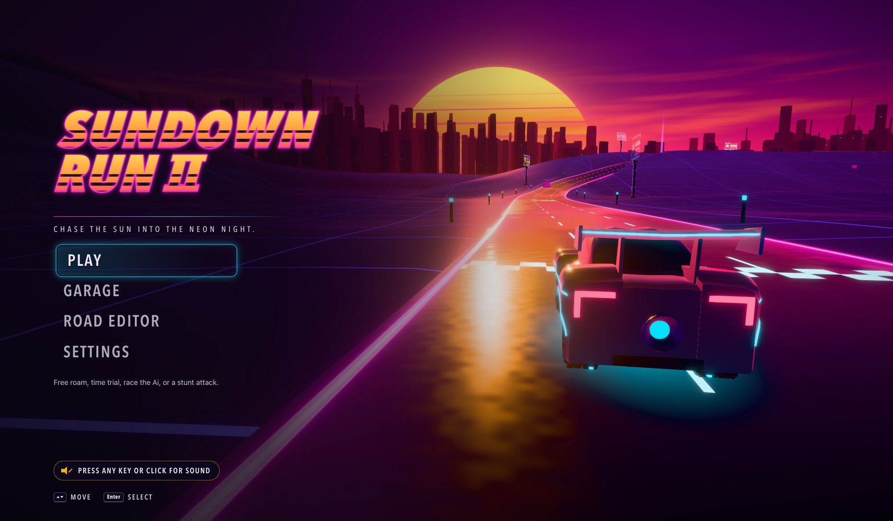

# Sundown Run II

A neon synthwave driving game for the browser. A giant striped sun sinks into a magenta sky, the city lights up window by window, and you drive a glowing car down a wet neon road: through loops, along wall rides, off ramps and over the big-air hill. Race Ai cars, beat your own ghost, smash crash props for points, hunt energy cores, draw your own tracks, and play with friends on the same wifi.

Everything you see and hear is made by the code: no downloaded models, textures, fonts or music.



## Play it

The game runs in your web browser, but it's served from your own computer, so there's a one-time setup: install **Git** (downloads the game and its updates) and **Bun** (runs it), then download the game. After that, starting it is one double-click on Windows or one command on a Mac. Use **Chrome** or **Edge**: that's what it's built and tested in.

Already have Bun and Git? The short version:

```
git clone https://github.com/NatMan3000/SundownRun2.git
cd SundownRun2
bun install
bun run start
```

### Windows: first-time setup

1. **Install Git.** Download it from https://git-scm.com/download/win and run the installer. Every default option is fine: just keep clicking Next.
2. **Install Bun.** Click Start, type **PowerShell**, open it, paste this line and press Enter:
   ```
   powershell -c "irm bun.sh/install.ps1 | iex"
   ```
   When it says Bun was installed, close PowerShell. (Node.js LTS from https://nodejs.org also works for playing on your own, but hosting multiplayer needs Bun.)
3. **Download the game.** Open PowerShell again (a fresh window, so it can find what you just installed) and paste these two lines:
   ```
   cd ~\Documents
   git clone https://github.com/NatMan3000/SundownRun2.git
   ```
   That makes a folder called `SundownRun2` inside your Documents folder.
4. **Start it.** In File Explorer, open `Documents\SundownRun2` and double-click **`Sundown Run II.bat`**. If Windows asks whether you want to run it, say yes. The first time, it installs the game's parts (about a minute), then opens the game in your browser at **http://localhost:5201**.
5. **Keep the black window open** while you play. Closing it stops the game.
6. **Make it fast.** On a gaming laptop, do the one-time graphics card fix in [Make it fast](#make-it-fast-give-the-browser-the-real-graphics-card) below, or the game may crawl.

From then on, just double-click **`Sundown Run II.bat`** to play. Right-click it and pick **Send to > Desktop (create shortcut)** to put it on the desktop. To get the newest version, double-click **`Sundown Run II Update.bat`** (see [Updating](#updating)).

**Downloaded the ZIP instead of using Git?** (On GitHub: the green **Code** button, then **Download ZIP**.) Unzip it somewhere easy like `Documents\SundownRun2` and the steps from 4 on work the same, but the Update .bat won't: it needs a folder made by `git clone`. To update a ZIP copy, download a fresh ZIP.

### Mac: first-time setup

1. **Open Terminal.** Press Cmd + Space, type **Terminal**, press Enter. Everything below gets pasted into this window, one line at a time, each followed by Enter.
2. **Install Git.** Type `git --version`. If it prints a version number, you already have it. If a box pops up offering to install the "command line developer tools", click **Install** and wait for it to finish (a few minutes).
3. **Install Bun.** Paste these two lines (the first makes sure the settings file Bun adds itself to exists; a brand-new Mac doesn't have one):
   ```
   touch ~/.zshrc
   curl -fsSL https://bun.sh/install | bash
   ```
   Then quit Terminal (Cmd + Q) and open it again, so it can find Bun. Check with `bun --version`: it should print a number.
4. **Download the game** into your Documents folder:
   ```
   cd ~/Documents
   git clone https://github.com/NatMan3000/SundownRun2.git
   cd SundownRun2
   bun install
   ```
   `bun install` fetches the game's parts (about a minute, first time only).
5. **Start it.**
   ```
   bun run start
   ```
   It opens the game in your browser at **http://localhost:5201**. Leave Terminal open while you play; press **Ctrl + C** in it to stop the game.

Next time, open Terminal and run:

```
cd ~/Documents/SundownRun2
bun run start
```

**Updating on a Mac:** `cd ~/Documents/SundownRun2`, then `git pull` and `bun install`. If `git pull` refuses because you changed some of the game's files, and you want to throw those changes away (the same do-over the Windows Update .bat does), run `git fetch origin`, `git reset --hard origin/main` and `git clean -fd`. Tracks you drew in the editor live in the browser and are safe; track files you added to `tracks/` yourself are removed by that last command, so copy them somewhere else first.

### Something went wrong?

| What you see | What to do |
|---|---|
| "Could not find Bun or Node.js" (Windows) | Install Bun (step 2 above), then close the black window and double-click the .bat again. |
| "Manually add the directory to ~/.zshrc" while installing Bun (Mac) | Bun installed fine; it just couldn't tell Terminal where it lives. Run `touch ~/.zshrc`, run the install line again, then quit and reopen Terminal. |
| `bun: command not found` (Mac) | Quit Terminal and open it again after installing Bun. If it still happens, see the row above. |
| `git: command not found` / "'git' is not recognized" | Install Git (step 1), then open a fresh Terminal or PowerShell window. |
| "Port 5201 is already in use" | The game is already running in another window. Use that one, or close it and start again. |
| "Something went wrong installing the dependencies" | Check the internet works, then run it again. |
| A Node.js error about the version | Node.js needs version 20.19 or newer (or 22.12+). Install the current LTS from https://nodejs.org, or use Bun instead. |
| The game runs but crawls | Windows: the [graphics card fix](#make-it-fast-give-the-browser-the-real-graphics-card). Anywhere: Settings > Graphics > Quality, set to Medium or Low. |
| No sound | Press a key or click once: the browser keeps sound off until you do (a controller press doesn't count). |

## Controls

| Action | Keyboard | Xbox controller |
|---|---|---|
| Throttle / brake and reverse | W / S or Up / Down | RT / LT |
| Steer | A / D or Left / Right | Left stick |
| Handbrake (drift) | Space | A |
| Tricks in the air | hold Space, then W/S to flip, A/D to roll | hold A, then the left stick |
| Camera (chase, close, bonnet) | C | RB |
| Rewind time (hold it: up to 10 seconds back) | Backspace | LB |
| Back to the road | R | Y |
| Restart at the start line | Shift + R | View |
| Menu | Esc | Menu |
| Start a race or tag round (multiplayer) | G | X |

Whichever you touched last is in charge: you can swap between keyboard and controller at any time. In menus, the arrows or d-pad move, Enter or A picks, Esc or B goes back, and Q/E or LB/RB switch tabs.

Sound starts after your first key press or click (that's the browser's rule; a controller press doesn't count). The game shows a reminder until it does.

## What's in it

- **Four tracks.** *Afterglow Valley*: a figure-eight through an open neon valley with a loop into the sun, a wall ride, ramps, a crossover bridge and the big-air hill. *The Hyperdrome*: an enclosed stadium oval for top speed, with a speed trap and banked ends you can tilt from flat to steep with a live slider (pause menu or Settings > Track). *Neon Pocket*: a twisty little circuit, written as a single file to prove that a track is just a file. *Ember Pass*: a double figure-eight at dusk that shows off everything the road can do: a tunnel straight through a hill with the other road climbing over it, an underpass under a bridge, a raised causeway and a dug-in dip, a hand-banked sweeper, wide and narrow road, a jump, a wall ride, a loop and a half pipe.
- **Modes.** Free Roam (tricks, crash props, smashable posts and the energy-core hunt), Time Trial against your ghost, Race against 0 to 5 Ai racers, and Stunt Attack (90 seconds for the biggest trick score). In multiplayer: Race, Free Roam and Tag.
- **Rewind** (Josh's idea). Crashed? Hold Backspace (or LB) and time runs backwards: your car slides back along the way it came, and in a race every Ai car goes back with you. Let go and you drive on from there. It remembers 10 seconds (`rewindSeconds` in `src/core/config.ts`). A lap you rewound in can't be a record, trick points from the rewound bit are taken back, and it's off in multiplayer.
- **The garage.** Five cars (Dart, Blade, Brick, Manta, Pulse), with your own paint, underglow and light-trail colours.
- **The road editor.** Draw a road with the mouse like a pencil and the game turns it into a proper track: it smooths it, opens up corners that are too tight, banks the corners, closes the loop and turns crossings into bridges. Then place boost pads, ramps, loops, wall rides, crash props, energy cores and the start line, and press Test drive. Or try *drive to draw*: the car lays road behind it as you drive. Your tracks save in the browser, and Export / Import moves them between computers as the same `.json` file the built-in tracks use.
- **The world map.** Pause, then Map, for a top-down view of the track you're on.
- **Settings** for everything you can feel: car and colours, handling, camera, sound, time of day, Ai racers, the Hyperdrome's bank angle and graphics quality.

## Josh: this bit is for you

- **`src/core/config.ts`** is your file. Every number in it is something you can feel in the game: grip, power, top speed, camera, colours, how fast the sun sets, how many Ai cars race you. Change one, save, and the game changes straight away. If you change something in the Settings menu and later edit the same thing in `config.ts`, your edit in the file wins.
- **`tracks/`** holds every track. Each one is a single file. `tracks/README.md` explains every line, and you can write your own: copy `neon-pocket.json`, change it, check it with `bun run tracks:check tracks/your-track.json`, then drive it at `http://localhost:5201/?track=your-track`.
- **`bun run learn`** makes **`Learn To Code.html`**: a workshop written for you, with little programs you can run right in the page and missions in the real game files.
- **`src/core/palette.ts`** holds every colour in the game.

## Report a problem

Something broken, or got an idea? Pick **Report a problem** on the title screen (just under the main menu) or in the pause menu. Choose what kind it is, give it a short title, say what happened (what you were doing, what went wrong, what you expected), and press **Send**.

- It goes on the game's **public** GitHub page, where anyone can read it. So use a first name or a nickname only, and never put your address, school or anything private.
- The game adds the details that help fix it: the track, your car, where you were and how fast, how smoothly the game was running and your graphics chip. **See what gets sent** shows every one before you send.
- To type, press **Enter** on a box or click it. While you type, your keys only go into the box, so nothing drives the car. **Esc** stops typing, **Tab** jumps to the next box, **Ctrl+Enter** sends. The controller does everything else, but typing needs a keyboard.
- If it says **Saved on this computer**, nothing is lost: it sends by itself with a later report, once reporting is switched on and the internet works.

### Share your tracks

In the road editor, open **Library**. Every track of yours has a **Share** button: it puts the track on the game's GitHub page so anyone can download it. Before it goes, a box says what goes public and lets you set **Made by**, the name shown with it. That page is public, so use a nickname, not your real name. Share the same track again and it updates the same post instead of making a copy.

**Shared tracks** (the Library's second tab) lists everybody's shared tracks, newest first, with a little map of each. **Download** puts a copy in your tracks: it's checked first like Import a track file, it never replaces a track you already have (a name that's taken gets a number), and a track changed on GitHub after it was shared, or cut off, is refused and it says why.

Sharing uses the same key as reporting, so it works once reporting is switched on (below); until then a shared track waits on this computer and goes up by itself later. Shared tracks are issues labelled `track`. To take one down, close its issue on GitHub.

### Turn on reporting (for Dad)

The game's own server posts the reports with a GitHub key that lives only on this computer (GitHub accounts start at 13, so Josh can't use one of his own). Until there's a key, reports wait in `reports/pending/`.

1. On github.com, signed in as NatMan3000, open https://github.com/settings/personal-access-tokens and click **Generate new token** (a fine-grained token).
2. Name it something like "Sundown Run II reports", set **Resource owner** to NatMan3000, and pick an **Expiration** date.
3. **Repository access:** Only select repositories, then **SundownRun2**.
4. **Permissions:** Repository permissions, **Issues: Read and write**. Nothing else.
5. Generate it and copy it (it starts with `github_pat_`).
6. In the game folder on Josh's computer, save the key as the only line of a file called **`github-token.txt`**.

No restart needed: **Report a problem** now says "Reporting is on", and anything waiting goes out with the next report. The file is gitignored, so it's never uploaded, and the Update .bat leaves it alone. Reports arrive as issues labelled `from the game` plus `bug` or `idea`. When the key expires, reports save again and the game's black window says GitHub turned the key down: make a new one the same way. (The key can also come from the `SR2_GITHUB_TOKEN` environment variable instead of the file.)

## Multiplayer: race, tag and smash on the same wifi

ONE computer is the **host**. Everyone needs to be on the same wifi.

- **Windows:** double-click **`Sundown Run II Multiplayer.bat`**. The first time, it asks for an admin YES: that adds the Windows Firewall rule that lets friends connect (ports 5201-5202). Without it, Windows silently blocks them. Don't type `bun run mp` into PowerShell; the .bat file is the way.
- **Mac or Linux:** run `bun run mp` in a terminal. If macOS asks whether "bun" may accept incoming connections, click **Allow**.

It prints two links. Open the first one on the host. Open the second one on every other computer: they need **nothing installed**, because the game loads straight from the host. Change `name=` in the link to your own name (that's your name tag), and set `color=` to `orange`, `yellow`, `mint`, `pink`, `purple`, `cyan`, `red` or `white` so every car looks different.

**The host picks the track**, and everyone else gets it sent over automatically, even one you drew yourself in the editor. Ai racers sit multiplayer out; it's just you lot.

- **Press G (X on a controller) to start a race:** everyone lines up on the grid, 3-2-1, engines locked until GO, and the first one home wins. Every race deals a fresh set of crash props, and when your mate smashes one you see it burst too.
- **Tag:** pick Tag mode and press G. One player is "it" and glows; bump someone to pass it on (no tag-backs for 2 seconds). After 3 minutes, whoever spent the least time as "it" wins.
- **Ramming is real:** hit someone and they get shoved. Prefer driving through each other like ghosts? Set `multiplayerRam: false` in `src/core/config.ts`.

**Something not working?**

- The other computer's link won't load: check both are on the same wifi (not a guest network) and that the firewall rule was added (run the .bat again and click YES). If the printed address doesn't work, `bun run mp` lists other addresses to try.
- You can see the game but not each other: the relay (port 5202) is blocked. Same firewall fix.
- Someone's wifi blinks: they reconnect by themselves, and keep their place in a race or a tag round if they're back within 15 seconds.
- More than two players works: every extra person who opens the link joins the same world.

## Windows

First-time setup is in [Play it](#windows-first-time-setup) above.

### Make it fast: give the browser the real graphics card

Gaming laptops have two graphics chips: a small one built into the processor and the big one (on Josh's laptop, an NVIDIA RTX 4060). Windows often hands the browser the small one, and then the game crawls. Fix it once:

1. Open **Settings**, then **System**, then **Display**, then **Graphics** (near the bottom).
2. Find your browser in the list (Chrome or Edge). If it isn't there, click **Browse** (or "Add desktop app") and pick it.
3. Click the browser, then **Options** (or open its drop-down), choose **High performance**, and **Save**.
4. Close the browser completely and open the game again.

**How to check which chip the game is using:** in the game, open **Settings > Graphics**: the "Graphics chip" row should name the NVIDIA card. You can also type `chrome://gpu` (or `edge://gpu`) into the address bar and look for "GL_RENDERER": it should mention NVIDIA. While you play, **Task Manager > Performance** shows which GPU is busy.

If it's still slow, set **Settings > Graphics > Quality** to Medium or Low.

### Updating

Double-click **`Sundown Run II Update.bat`**. It downloads the latest version and makes the folder an exact copy of it, so any changes you made to the game's files are thrown away (that's on purpose: it's the do-over button). Tracks you drew in the editor live in the browser, so they're safe. Track files you dropped into `tracks/` yourself are removed, so export or copy them somewhere else first.

### Xbox controller

Pair it with Windows over Bluetooth (Settings > Bluetooth & devices > Add device), open the game, and press any button once so the browser notices it. It works straight away; no setup.

## For developers

| Command | What it does |
|---|---|
| `bun run dev` | Dev server on http://localhost:5201 (strict port) |
| `bun run build` / `bun run typecheck` | Production build / TypeScript check |
| `bun run tracks:check [file] [--physics] [--bench]` | Validate and build every track (or one), with physics proofs |
| `bun run mp` / `bun run relay` | Host multiplayer (relay on 5202 + LAN dev server) / relay alone |
| `bun run mp:check` / `bun run test:relay` | Two-client multiplayer proof / relay unit tests |
| `bun run probe -- --url <u> ...` | Drive the game in a private headless Chrome: screenshots, evals, perf |
| `bun run learn` | Generate `Learn To Code.html` |

Report a problem (`server/issues.ts`, served at `/api/report` by the dev and preview servers): test it against a fake GitHub with `SR2_ISSUES_API=http://127.0.0.1:<port>` and keep waiting reports out of the folder with `SR2_REPORTS_DIR=<dir>`. Never test against the real repository.

URL switches for testing: `?track=<id>`, `?mode=free|timetrial|race|stunt`, `?ai=<n>`, `?demo=1` (autopilot plus a frame-time recording in `window.__perf`), `?time=<0..1>`, `?quality=low|medium|high`, `?cam=<bookmark>`, `?editor=1`, `?nomusic=1`, `?mp=1&name=&color=`.

Start with [`CLAUDE.md`](CLAUDE.md) (how the code is organised) and [`CONSTITUTION.md`](CONSTITUTION.md) (the art direction, the 60fps budget and the feel standard every change is judged against).
